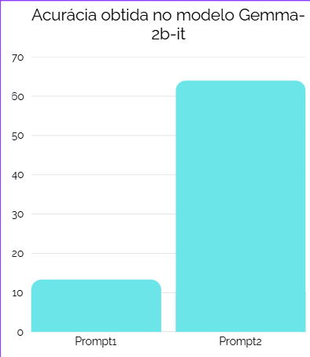
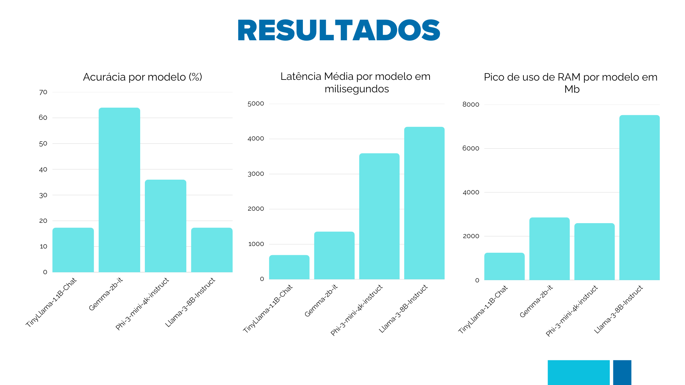

# Edge LLM Benchmark: Avaliando SLMs no Raspberry Pi 5

Este repositório documenta um benchmark abrangente de Modelos de Linguagem Compactos (SLMs) executados em um Raspberry Pi 5. O objetivo é avaliar a viabilidade e o trade-off entre eficiência (latência, uso de memória) e qualidade (acurácia) para aplicações de Inteligência Artificial na borda (Edge AI), como assistentes virtuais offline.

Este trabalho foi apresentado na **24ª Mostra da Produção Universitária (MPU)** da Universidade Federal do Rio Grande - FURG.

## Objetivos

-   **Avaliar a Performance:** Medir a latência, o uso de pico de RAM de SLMs populares em hardware de baixo custo.
-   **Medir a Qualidade:** Aferir a acurácia dos modelos em uma tarefa de classificação de intenção para automação residencial.

## Metodologia

### Hardware e Software

| Componente      | Especificação                | Justificativa                                                     |
| :-------------- | :--------------------------- | :---------------------------------------------------------------- |
| **Hardware**    | Raspberry Pi 5 (8GB RAM)     | Plataforma de borda de baixo custo, popular e com CPU ARM potente.  |
| **SO**          | Raspberry Pi OS (64-bit)     | Otimizado para o hardware e permite aproveitar toda a RAM.          |
| **Framework**   | `llama.cpp`                  | Biblioteca C++ de alta performance para inferência de LLMs em CPU.  |
| **Orquestração**| Script Python com Pandas   | Para automatizar os testes, coletar métricas e salvar os resultados.|

### Modelos Avaliados

Foram selecionados quatro modelos de diferentes tamanhos e criadores, todos na versão quantizada **Q4_0** em formato **GGUF**:

-   `TinyLlama-1.1B-Chat-v1.0` (1.1B parâmetros)
-   `Gemma-2b-it` (2B parâmetros)
-   `Phi-3-mini-4k-instruct` (3.8B parâmetros)
-   `Meta-Llama-3-8B-Instruct` (8B parâmetros)

## A Descoberta da Engenharia de Prompt

Uma descoberta crucial durante a pesquisa foi o impacto da **Engenharia de Prompt**. Uma primeira tentativa de classificação com uma instrução direta resultou em uma acurácia de apenas **13.3%** com o modelo Gemma-2b.

**Prompt 1 (Baixo Desempenho):**

"Classifique '{prompt_text}' em LIGAR_LUZ, DESLIGAR_LUZ, ... Intenção:"

A hipótese foi que o modelo necessitava de exemplos para entender a tarefa. Implementou-se uma abordagem onde o prompt foi enriquecido com um exemplo para cada intenção.

**Prompt 2 (Alto Desempenho):**
```python
prompt_exem = """Frase: 'Ascenda a luz da sala'
Intenção: LIGAR_LUZ
Frase: 'Pode deixar tudo escuro pra ver o filme?'
Intenção: DESLIGAR_LUZ
... (e assim por diante para todas as intenções)"""

prompt_full = f"{prompt_exem}\n\nFrase: '{prompt_text}'\nIntenção:"

Com esta mudança, a acurácia do mesmo modelo saltou para 64%, um aumento de 4.8x. Isso consolidou a engenharia de prompt como um passo essencial para uma avaliação justa e consistente dos modelos.



Resultados Finais

Os testes foram executados em um dataset de 75 frases. Os gráficos abaixo resumem o desempenho de cada modelo.


